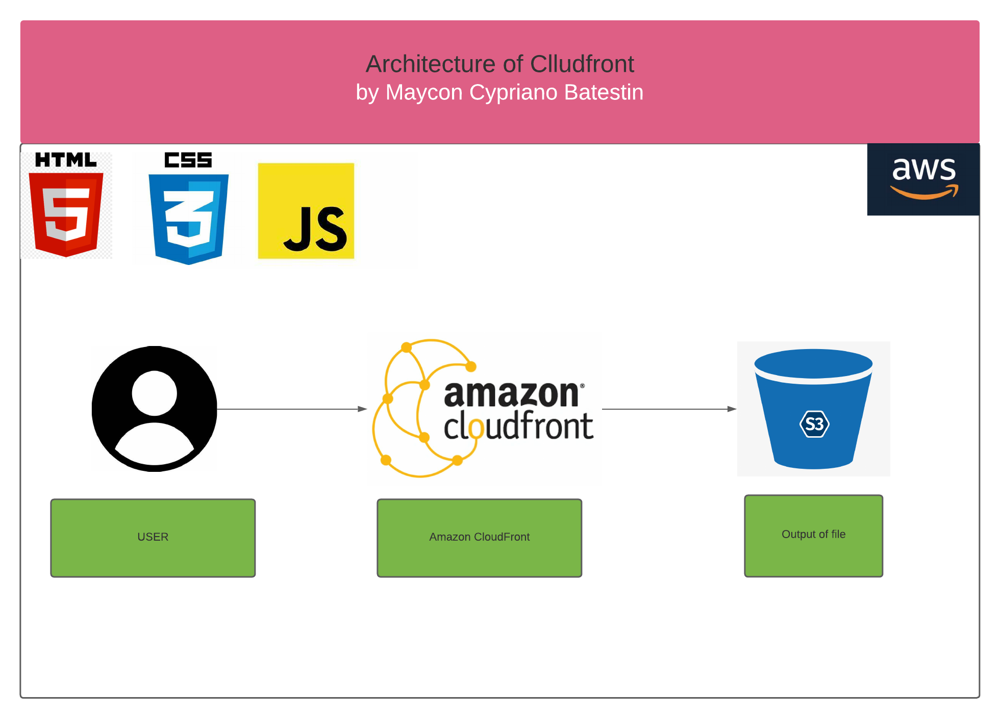

<h1 align="center">

<h3> 
 AMAZON CLOUDFRONT  
 </h3>
<h3> 
 ================= 
 </h3>

>> Arquitetura da solução:

>> <h3> Description </h3>
-------------------------

 
Amazon CloudFront is a web service that accelerates the delivery of static and dynamic web content, such as .html, .css, .js, and image files, to users. CloudFront distributes content through a global network of data centers called edge locations. When a user requests content that you are serving with CloudFront, the request is routed to the edge location that provides the lowest latency (delay), so the content is delivered with the best possible performance.
In this project we are simulating a static web page (in this case a copy of the netflix homepage). This project is allocated within an S3. Once on S3, cloudfront will create an access link to the hosted site. 

-------------------------

>> <h3> About CDN </h3>
-------------------------

CDN is an abbreviation for CONTENT DELIVERY NETWORK.
It is a network service of servers that store replicas of content from other sites in memory (cache) and deliver them to visitors, based on geographic location to connect them to the closest and fastest server, reducing latency. 

